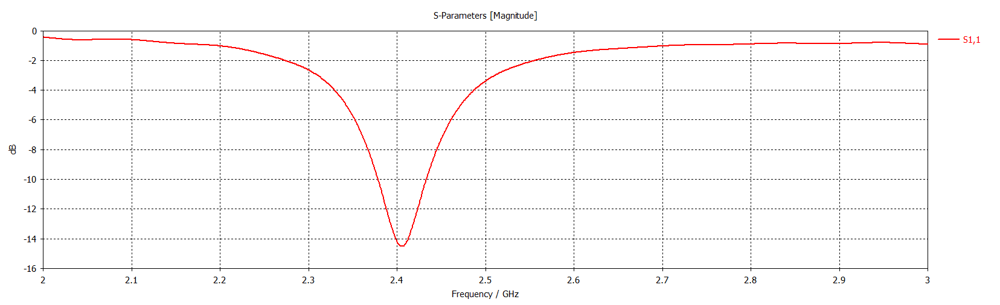
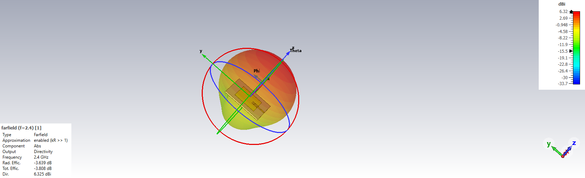
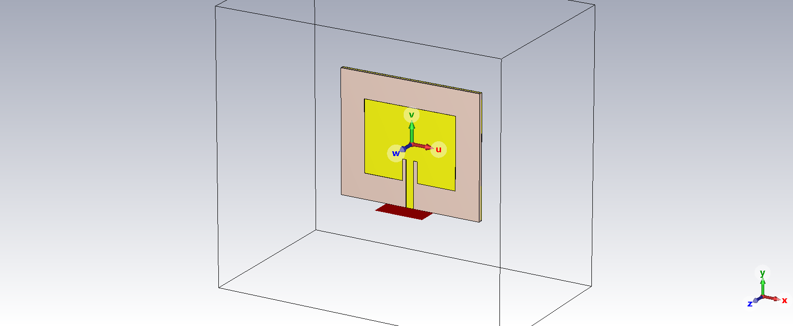

# 📡 Inset Feed Beslemeli 2.4 GHz Mikroşerit Yama Anten Tasarımı

Bu proje, **CST Studio Suite** kullanılarak 2.4 GHz ISM bandı (Wi-Fi/IoT uygulamaları) için tasarlanmış dikdörtgen bir Mikroşerit Yama Antenin (Microstrip Patch Antenna) tasarımını, matematiksel hesaplamalarını ve simülasyon sonuçlarını içerir.

Tasarımda, harici bir empedans uydurma devresi kullanmadan tam $50\Omega$ uyumu sağlamak için **Inset Feed (Yarık Besleme)** tekniği kullanılmıştır.

## 🎯 Proje Hedefleri
* **Hedef Frekans:** 2.40 GHz
* **Geri Dönüş Kaybı ($S_{11}$):** < -10 dB
* **Kazanç (Gain):** > 6 dBi
* **Empedans:** $50\Omega$

## 📐 Tasarım Parametreleri ve Matematiksel Arka Plan

Antenin boyutları, **İletim Hattı Modeli (Transmission Line Model)** kullanılarak teorik olarak hesaplanmış, Python ile doğrulanmış ve CST Studio Suite üzerinde optimize edilmiştir.

### 1. Substrate (Taban) Özellikleri
Dielektrik malzeme olarak yaygın ve düşük maliyetli **FR-4 (Lossy)** kullanılmıştır.
* Dielektrik Sabiti ($\epsilon_r$): **4.3**
* Yükseklik ($h$): **1.6 mm**

### 2. Genişlik Hesabı ($W$)
Antenin ışıma verimliliğini artırmak için genişlik şu formülle hesaplanmıştır:
$$W = \frac{c}{2f_r} \sqrt{\frac{2}{\epsilon_r + 1}} \approx 38.39 \text{ mm}$$

### 3. Efektif Dielektrik Sabiti ($\epsilon_{eff}$)
Dalgalar hem FR-4 içinde hem de havada yayıldığı için ortalama bir dielektrik sabiti hesaplanmalıdır:
$$\epsilon_{eff} = \frac{\epsilon_r + 1}{2} + \frac{\epsilon_r - 1}{2} \left[1 + 12\frac{h}{W}\right]^{-1/2}$$

### 4. Uzunluk Hesabı ($L$)
Kenarlardaki saçaklanma alanları (fringing fields - $\Delta L$) nedeniyle anten elektriksel olarak daha uzun görünür. Bu yüzden fiziksel boy kısaltılmıştır:
$$L = L_{eff} - 2\Delta L \approx 29.78 \text{ mm (Teorik)}$$
*(CST optimizasyonu sonrası tam 2.40 GHz rezonans için **29.1 mm** olarak belirlenmiştir).*

### 5. Inset Feed Derinliği ($F_i$) - "Tatlı Nokta"
Antenin kenarındaki yüksek empedansı (~300$\Omega$), besleme hattının $50\Omega$ empedansı ile eşlemek için yama içine bir yarık açılmıştır. Giriş mesafesi ($y_0$) Kosinüs-Kare kuralı ile bulunur:
$$R_{in}(y_0) = R_{edge} \cos^2\left(\frac{\pi}{L} y_0\right)$$
$50\Omega$ için çözüm:
$$y_0 = \frac{L}{\pi} \arccos\left(\sqrt{\frac{50}{R_{edge}}}\right) \approx 10.93 \text{ mm (Teorik)}$$
*(CST optimizasyonu sonrası -14.5 dB uyum için **8.5 mm** olarak belirlenmiştir).*

---

## 🛠️ Simülasyon Sonuçları (CST Studio Suite)

### 1. Geri Dönüş Kaybı ($S_{11}$)
Anten, **2.403 GHz** frekansında mükemmel rezonansa girmiş ve **-14.5 dB** geri dönüş kaybı sağlamıştır. Bu, gücün %96'sının iletildiğini, sadece %4'ünün geri yansıdığını gösterir.

*(Şekil 1: dB cinsinden S-Parametre Genliği)*

### 2. 3D Işıma Deseni (Farfield)
* **Yönlülük (Directivity):** 6.33 dBi
* **Ana Işıma Yönü:** Z-ekseni (Kartın karşısına doğru)
* **Desen:** Yönlü (Directional) ışıma karakteristiği.

*(Şekil 2: Yönlülüğü gösteren 3D Uzak Alan Deseni)*

### 3. Anten Yapısı
$50\Omega$ uyumu için optimize edilmiş Inset Feed yapısı ve besleme hattı.

---

## 📂 Nasıl Çalıştırılır?
1. `CST_Proje_2_Patch.cst` dosyasını CST Studio Suite ile açın.
2. **Parameter List** kısmından optimize değerleri kontrol edin ($L=29.1$, $Fi=8.5$).
3. **Time Domain Solver**'ı başlatın.

---
*Yazar: Utku Turan*
*Araçlar: CST Studio Suite 2025, Python*
