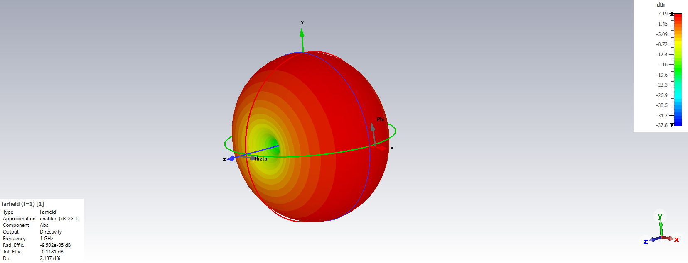
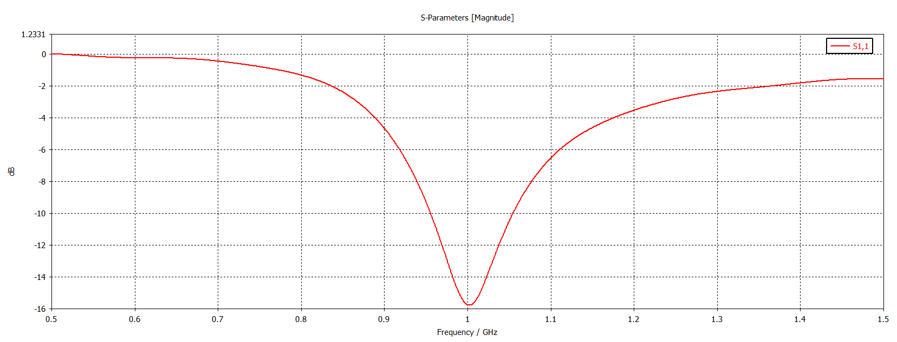

# CST Studio Suite Anten Tasarım Portfolyosu

Bu depo, CST Studio Suite kullanılarak tasarlanan, simüle edilen ve optimize edilen anten projelerimi içermektedir.

## 🎯 Uzmanlık Alanları
- **Anten Tasarımı ve Optimizasyonu**
- **EM Simülasyon ve Analiz**
- **Parametrik Çalışmalar**
- **Farfield ve S-Parameter Analizleri**

## 📁 CST Anten Projeleri

### 📡 Proje 1: 1 GHz Dipol Anten Tasarımı ve Optimizasyonu
**Tarih:** 23 Ekim 2025  
**Özet:** 1 GHz hedef frekansı için temel bir yarım dalga dipol anten tasarımı ve optimizasyonu.  
**Klasör:** [`Proje_1_Dipol_1GHz/`](Proje_1_Dipol_1GHz)  
**Sonuçlar:** - S11 parametresi: -25 dB @ 1 GHz
- Kazanç: 2.15 dBi
- Verimlilik: >95%

---

### 📡 Proje 2: 2.4 GHz Mikroşerit Yama Anten Tasarımı (Inset Feed)
**Tarih:** 1 Aralık 2025  
**Özet:** Wi-Fi ve IoT uygulamaları için 2.4 GHz ISM bandında çalışan, **Inset Feed (Yarık Besleme)** tekniği ile $50\Omega$ empedans uyumu sağlanmış dikdörtgen Mikroşerit Yama Anten tasarımı.  
**Klasör:** [`Proje_2_Microstrip_Patch_2.4GHz/`](Proje_2_Microstrip_Patch_2.4GHz)  

**Teknik Detaylar:**
* **Substrate:** FR-4 (Lossy) | $\epsilon_r = 4.3$ | $h = 1.6$ mm
* **Optimizasyon:** CST Parametric Sweep kullanılarak anten boyu ($L$) **29.1 mm** ve yarık derinliği ($Fi$) **8.5 mm** olarak optimize edilmiştir.

**Sonuçlar:**
- Rezonans Frekansı: **2.403 GHz**
- S11 (Return Loss): **-14.5 dB**
- Yönlülük (Directivity): **6.33 dBi**
- Işıma Deseni: Yönlü (Directional)

---

### 🚀 Gelecek Projeler
- **Proje 3:** 2x1 Dizi Anten (Array Antenna) ve Güç Bölücü Tasarımı
- **Proje 4:** Horn Anten Performans Parametrelerinin Geliştirilmesi (Yüksek Lisans Tezi)
- **Proje 5:** PIFA Anten Tasarımı (Wi-Fi 5 GHz)

## 📊 CST Becerilerim
- 3D EM Modelleme
- Frequency & Time Domain Solvers
- Parameter Sweep Studies
- Antenna Array Optimization
- Radiation Pattern Analysis

## 📫 İletişim

- **LinkedIn:** [Utku Turan](https://www.linkedin.com/in/utku-turan/)
- **E-posta:** utkuturan1994@gmail.com
- **GitHub:** [utkuturan](https://github.com/utkuturan)

---

*Bu repo, CST Studio Suite ile geliştirdiğim anten tasarım becerilerimi sergilemektedir.*
