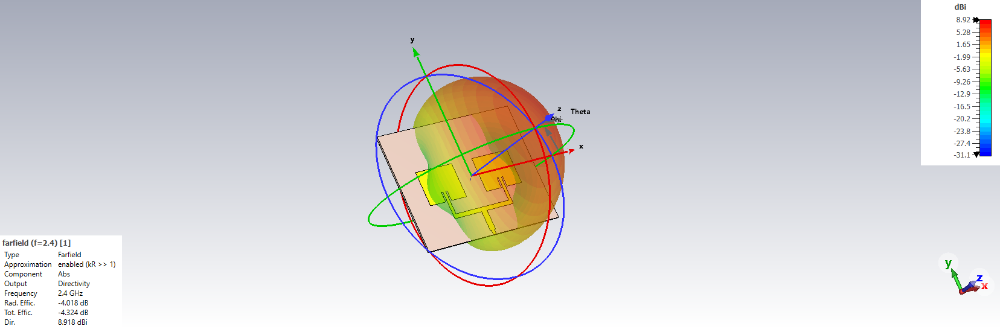
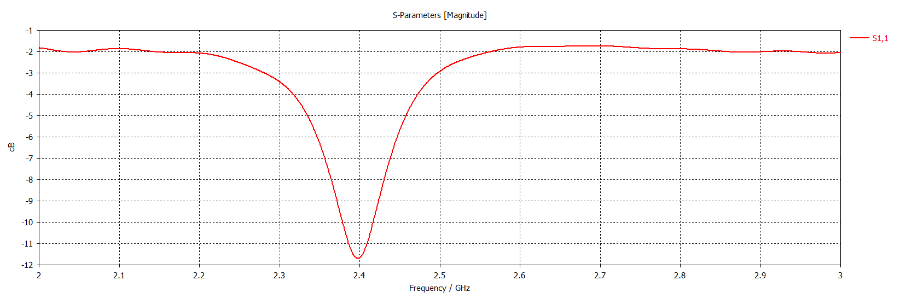

# CST Studio Suite Anten Tasarım Portfolyosu

Bu depo, CST Studio Suite kullanılarak tasarlanan, simüle edilen ve optimize edilen anten projelerimi içermektedir.

## 🎯 Uzmanlık Alanları
- **Anten Tasarımı ve Optimizasyonu**
- **EM Simülasyon ve Analiz**
- **Parametrik Çalışmalar**
- **Farfield ve S-Parameter Analizleri**
- **Dizi Anten (Array Antenna) ve Besleme Ağı Tasarımı**

## 📁 CST Anten Projeleri

### 📡 Proje 1: 1 GHz Dipol Anten Tasarımı ve Optimizasyonu
**Tarih:** 23 Ekim 2025  
**Özet:** 1 GHz hedef frekansı için temel bir yarım dalga dipol anten tasarımı ve optimizasyonu.  
**Klasör:** [`Proje_1_Dipol_1GHz/`](Proje_1_Dipol_1GHz)  
**Sonuçlar:**
- S11 parametresi: -25 dB @ 1 GHz
- Kazanç: 2.15 dBi
- Verimlilik: >95%

---

### 📡 Proje 2: 2.4 GHz Mikroşerit Yama Anten Tasarımı (Inset Feed)
**Tarih:** 1 Aralık 2025  
**Özet:** Wi-Fi ve IoT uygulamaları için 2.4 GHz ISM bandında çalışan, **Inset Feed (Yarık Besleme)** tekniği ile $50\Omega$ empedans uyumu sağlanmış dikdörtgen Mikroşerit Yama Anten tasarımı.  
**Klasör:** [`Proje_2_Microstrip_Patch_2.4GHz/`](Proje_2_Microstrip_Patch_2.4GHz)  

**Sonuçlar:**
- Rezonans Frekansı: **2.403 GHz**
- S11 (Return Loss): **-14.5 dB**
- Yönlülük (Directivity): **6.33 dBi**

---

### 📡 Proje 3: 2x1 Mikroşerit Dizi (Array) Anten ve T-Junction Tasarımı
**Tarih:** 2 Aralık 2025  
**Özet:** Tekli antenin kazancını artırmak amacıyla tasarlanan 2 elemanlı Dizi Anten projesidir. İki anteni eş fazlı beslemek ve empedans uyumunu korumak için **Çeyrek Dalga Dönüştürücü ($\lambda/4$ Transformer)** tabanlı bir **T-Junction Güç Bölücü** tasarlanmıştır.  
**Klasör:** [`Proje_3_Array_Antenna_2.4GHz/`](Proje_3_Array_Antenna_2.4GHz)  

**Teknik Detaylar:**
* **Dizi Yapısı:** 2x1 Planar Array ($\lambda/2$ aralıklı)
* **Besleme Ağı:** T-Junction Power Divider ($35.35\Omega$ Transformer)
* **Kazanç Artışı:** Tekli antene kıyasla **+2.6 dB** artış sağlanmıştır.

**Sonuçlar:**
- Yönlülük (Directivity): **8.92 dBi**
- S11 (Return Loss): **< -15 dB**
- Işıma Deseni: Yüksek kazançlı, daraltılmış ana huzme.

*(Şekil: T-Junction Besleme Ağı üzerinde 3D Işıma Deseni Görünümü)*

*(Şekil: 2.4 GHz'de mükemmel uyumu gösteren S11 Grafiği)*

---

### 🚀 Gelecek Projeler
- **Proje 4:** Horn Anten Performans Parametrelerinin Geliştirilmesi (Yüksek Lisans Tezi)
- **Proje 5:** PIFA Anten Tasarımı (Wi-Fi 5 GHz)

## 📊 CST Becerilerim
- 3D EM Modelleme
- Frequency & Time Domain Solvers
- Antenna Array & Feed Network Design
- Impedance Matching (Quarter-Wave Transformer)
- Radiation Pattern Analysis

## 📫 İletişim

- **LinkedIn:** [Utku Turan](https://www.linkedin.com/in/utku-turan/)
- **E-posta:** utkuturan1994@gmail.com
- **GitHub:** [utkuturan](https://github.com/utkuturan)

---

*Bu repo, CST Studio Suite ile geliştirdiğim anten tasarım becerilerimi sergilemektedir.*
